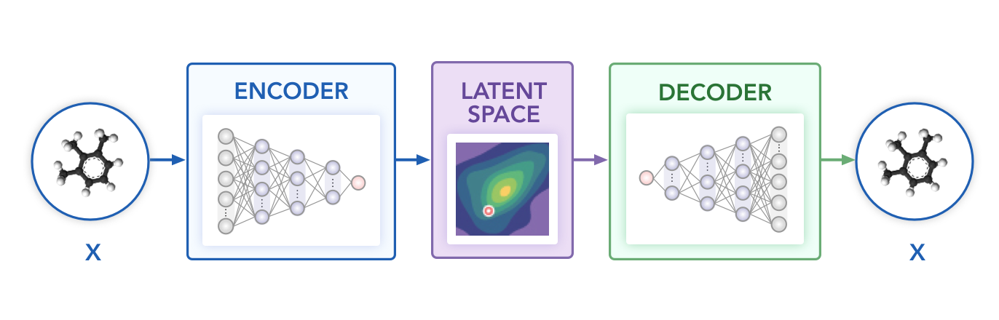

# Adversarial autoencoder

Adversarial Autoencoders (AAE) [1] combine the idea of VAE with that of adversarial training as found in GAN. One of the main drawbacks of VAE is the KL divergence term that has a closed-form analytical solution only for a handful of distributions. In AAE, the KL divergence term is avoided by training a discriminator network to predict whether a given sample came from the latent space of the AE or from a prior distribution. Parameters are optimized to minimize the reconstruction loss and to minimize the discriminator loss. Kadurin et al. [2] applied AAE architecture to the drug generation task. The model consists of an encoder with a 1-layer bidirectional LSTM with 380 hidden dimensions, a decoder with a 2-layer LSTM with 640 hidden dimensions and a shared embedding of size 32. The latent space is of dimension 640, and the discriminator networks is a 2-layer fully connected neural network with 640 and 256 nodes respectively, utilizing the ELU activation function. Training is done with a batch size of 128, with the Adam optimizer using a learning rate of 0.001 for 25 epochs.

## Links

[1] [Adversarial Autoencoders](https://arxiv.org/abs/1511.05644)

[2] [The cornucopia of meaningful leads: Applying deep adversarial autoencoders for new molecule development in oncology (for molecular fingerprints)](https://www.ncbi.nlm.nih.gov/pmc/articles/PMC5355231)
