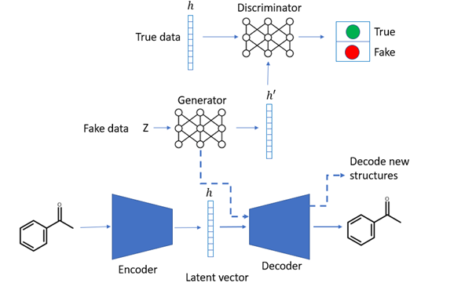

LatentGAN
=========

  

LatentGAN [1] with heteroencoder trained on ChEMBL 25 [2], which encodes SMILES strings into latent vector representations of size 512. A Wasserstein Generative Adversarial network with Gradient Penalty [3] is then trained to generate latent vectors resembling that of the training set, which are then decoded using the heteroencoder. This model uses the Deep-Drug-Coder heteroencoder implementation [4].

Important!
==========
Currently, the Deep-Drug-Coder [4] and its dependency package molvecgen [5] are not available in pypi, these have to be installed from their respective repositories (links provided below). Please note that you have to use the MOSES branch of the DeepDrugCoder, due to combability issues of the latest update of the heteroencoder.

## References

[1] [A De Novo Molecular Generation Method Using Latent Vector Based Generative Adversarial Network](https://chemrxiv.org/articles/A_De_Novo_Molecular_Generation_Method_Using_Latent_Vector_Based_Generative_Adversarial_Network/8299544)

[2] [ChEMBL](https://www.ebi.ac.uk/chembl/)

[3] [Improved training of Wasserstein GANs](https://arxiv.org/abs/1704.00028)

[4] [Deep-Drug-Coder](https://github.com/pcko1/Deep-Drug-Coder)

[5] [molvecgen](https://github.com/EBjerrum/molvecgen)
