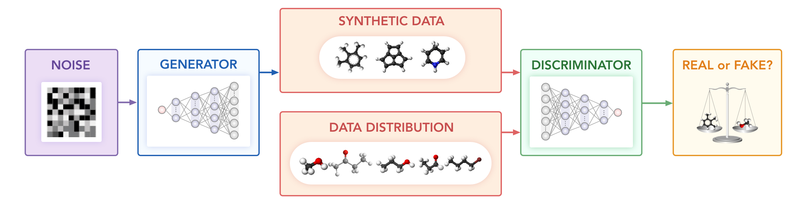

# Objective-Reinforced Generative Adversarial Network

Objective-reinforced generative adversarial network (ORGAN) [1,2] is a sequence generation model based on adversarial training that aims at generating discrete sequences that emulate a data distribution while biasing the generation process towards some desired objective rewards using reinforcement learning. ORGAN incorporates at least 2 networks: a generator network and a discriminator network. The goal of the generator network is to create synthetic data examples that are indistinguishable from the empirical data distribution. The discriminator exists to learn to distinguish synthetic from real data samples. Both models are trained in alternation.

To properly train a GAN, the gradient must be backpropagated between the generator and discriminator model, which is not possible when the data samples come from a discrete distribution such as multinomial since discrete distributions are non-differentiable. SeqGAN10 proposed to learn a policy gradient that can be backpropagated and calculated using the REINFORCE81 algorithm. ORGAN extended this framework to include other reward functions besides the discriminator.  Reinforcement is done with an N-depth Monte Carlo tree search, and the reward is a weighted sum of probabilities from the discriminator and objective reward. Both the generator and discriminator are pre-trained for 250 and 50 epochs respectively, and then jointly trained for 100 epochs utilizing the Adam optimizer with a learning rate of 0.0001. In the experiments, we used chemical validity and uniqueness as rewards.

## Links

[1] [Objective-Reinforced Generative Adversarial Networks (ORGAN) for Sequence Generation Models](https://arxiv.org/abs/1705.10843)

[2] [Optimizing distributions over molecular space. An Objective-Reinforced Generative Adversarial Network for Inverse-design Chemistry (ORGANIC)](https://chemrxiv.org/articles/ORGANIC_1_pdf/5309668)
